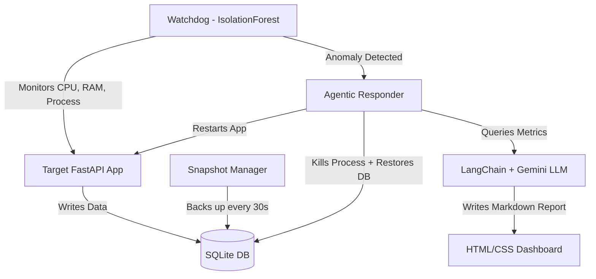

# DeepBell: AI-Driven Point-in-Time Recovery & Root Cause Analysis


**DeepBell** is a two-week Major Project in Site Reliability Engineering (SRE) and AIOps, built strictly using Python, HTML, and CSS. It is an autonomous monitoring agent that uses Machine Learning to detect systemic failures in real time, executes automated Point-in-Time Recovery (PITR), and leverages a Large Language Model (Google Gemini via LangChain) to synthesize a professional Root Cause Analysis (RCA) report — all without human intervention.

---

## System Architecture

DeepBell is structured as four independent Python modules that form a complete autonomous recovery pipeline:

```
deepbell/
├── target_app/          # The victim FastAPI service (SQLite backend + HTML/CSS dashboard)
│   ├── main.py          # FastAPI app with fault injection endpoints + Jinja2 dashboard route
│   ├── requirements.txt
│   ├── templates/
│   │   └── index.html   # Clean dark mode dashboard (Vanilla HTML)
│   └── static/
│       └── styles.css   # Glassmorphism CSS (zero frameworks)
│
├── snapshot_manager/    # PITR daemon: rolling 30-second database snapshots
│   └── snapshot.py
│
├── watchdog/            # ML anomaly detection engine
│   ├── telemetry.py     # Streams live psutil metrics to SQLite
│   └── anomaly.py       # IsolationForest model for anomaly scoring
│
├── responder/           # Agentic auto-recovery and LLM RCA synthesis
│   ├── rollback.py      # Kills crashed process, restores DB, restarts app
│   ├── llm_analyst.py   # LangChain + Gemini pipeline to generate RCA reports
│   └── requirements.txt
│
└── data/                # Runtime databases (app.db, metrics.db) and backups/
```



---

## Core Features

- **Autonomous Anomaly Detection:** A background `watchdog` continuously streams process-level metrics (CPU %, RAM %, thread count) via `psutil` and scores each reading using a trained `IsolationForest` model. No thresholds. No manual rules.
- **Point-in-Time Recovery (PITR):** The `snapshot_manager` maintains rolling 30-second SQLite backups. The `responder` automatically restores the most recent healthy snapshot the moment a crash is confirmed.
- **Agentic RCA Generation:** The `responder` queries pre-crash telemetry from the metrics database, structures it into a prompt, and calls Google Gemini via LangChain to generate a professional post-mortem in Markdown.
- **Live Web Dashboard:** A clean dark mode dashboard is served directly by FastAPI using Jinja2 templates. It automatically loads and renders the latest AI-generated RCA report using `marked.js`.
- **Chaos Engineering Endpoints:** Built-in fault injection for realistic testing — memory leaks, CPU spikes, database corruption, and fatal process crashes.

---

## Getting Started

### Prerequisites
- Python 3.10+
- A free Google Gemini API key from [Google AI Studio](https://aistudio.google.com/)

### 1. Start the Target Application + Dashboard
```bash
cd target_app
pip install -r requirements.txt
python -m uvicorn main:app --reload
```
Open `http://127.0.0.1:8000` to see the live dashboard.
API docs at `http://127.0.0.1:8000/docs`.

### 2. Start the Snapshot Manager (separate terminal)
```bash
cd snapshot_manager
python snapshot.py
```

### 3. Start the Watchdog (separate terminal)
```bash
cd watchdog
pip install -r requirements.txt
python telemetry.py
```

### 4. Configure the Responder
Create a `.env` file inside the `responder/` directory:
```
GOOGLE_API_KEY=your_api_key_here
```
Then run the RCA generation manually after a crash:
```bash
cd responder
pip install -r requirements.txt
python rollback.py       # Restore system
python llm_analyst.py    # Generate RCA report
```

---

## Chaos Testing

Simulate real-world catastrophic failures against the live app to trigger the full recovery pipeline:

| Endpoint | Type | Effect |
|---|---|---|
| `GET /fault/memory_leak?size_mb=50` | Memory | Allocates unreleased memory blocks |
| `GET /fault/cpu_spike?duration_sec=5` | CPU | Runs a blocking busy-loop |
| `GET /fault/corrupt_db` | Database | Writes garbage bytes to SQLite |
| `GET /fault/fatal_crash` | Process | Calls `sys.exit(1)` — kills the server |

---

## Project Timeline

| Week | Dates | What Was Built |
|---|---|---|
| Week 1 | June 4 - June 6 | `target_app` FastAPI service, SQLite schema, `snapshot_manager` PITR daemon |
| Week 2 | June 7 - June 10 | `responder` module: process recovery (`rollback.py`), LangChain + Gemini RCA pipeline (`llm_analyst.py`) |
| Week 2 | June 11 - June 13 | `watchdog` ML engine (IsolationForest), HTML/CSS dashboard served via Jinja2, final integration |

---

## What Remains (Optional Enhancements)

The core system is fully functional. The following are potential extensions for future work:

- **Real-time WebSocket metrics** on the dashboard (live CPU/RAM graphs without page refresh)
- **Email / Slack alerting** when the Watchdog triggers a recovery event
- **Multi-app support** — extending the Watchdog to monitor more than one process simultaneously
- **Persistent ML model training** — saving and reloading the IsolationForest model after learning a baseline

---

*Developed as a Major Project in Distributed Systems, AIOps, and Agentic AI. Built entirely in Python, HTML, and CSS.*
