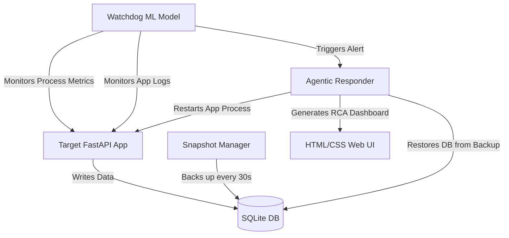

# DeepBell: AI-Driven Point-in-Time Recovery & Root Cause Analysis


**DeepBell** is a major project focused on Site Reliability Engineering (SRE) and AIOps, built strictly using Python, HTML, and CSS. It is an autonomous monitoring agent that uses Machine Learning to predict and detect systemic failures, executes automated Point-in-Time Recovery (PITR), and leverages Large Language Models (LLMs) to generate exact Root Cause Analysis (RCA) reports.

---

## Core Features

- **Anomaly Detection (Watchdog):** Streams live process metrics (`psutil`) and uses an unsupervised `IsolationForest` ML model to detect silent failures (e.g., memory leaks, CPU lockups).
- **Automated Point-in-Time Recovery (PITR):** Maintains rolling database snapshots and automatically restores the system to the last known healthy state upon crash detection.
- **Agentic RCA Generation:** Aggregates pre-crash telemetry and stack traces, passing them to an LLM to synthesize a human-readable, precise post-mortem report.
- **Web Dashboard:** A pure HTML/CSS dashboard served via FastAPI to visualize real-time metrics and historical recovery reports.

---

## System Architecture

DeepBell consists of four primary Python modules:

1. **Target Application:** A standalone FastAPI service writing to a SQLite database.
2. **Snapshot Manager:** A background Python script ensuring data durability via continuous rolling backups.
3. **ML Watchdog:** The telemetry engine detecting quantitative and qualitative anomalies at the process level.
4. **Agentic Responder:** The LangChain orchestrator managing recovery logic and LLM synthesis.



---

## Getting Started

Currently, the project is executing **Phase 1** (Target App & Snapshot Manager).

### 1. Start the Target Application
Navigate to the `target_app` directory to spin up the victim service:
```bash
cd target_app
pip install -r requirements.txt
uvicorn main:app --reload
```
API Documentation is available at `http://127.0.0.1:8000/docs`.

### 2. Start the Snapshot Manager
In a secondary terminal, initialize the PITR daemon:
```bash
cd snapshot_manager
python snapshot.py
```

---

## Chaos Testing

You can simulate catastrophic system failures using the following endpoints to trigger the Watchdog and Auto-Recovery:

*   **Trigger Memory Leak:** `GET /fault/memory_leak?size_mb=50`
*   **Trigger CPU Spike:** `GET /fault/cpu_spike?duration_sec=5`
*   **Corrupt Database:** `GET /fault/corrupt_db`
*   **Fatal Process Crash:** `GET /fault/fatal_crash`

---
*Developed as a Major Project focusing on modern Distributed Systems and Agentic AI workflows.*
