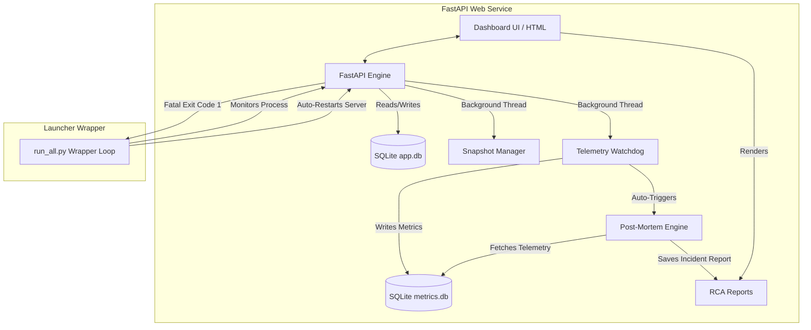

# DeepBell: Automated Point-in-Time Recovery & Telemetry Analytics Console


DeepBell is a self-contained SRE (Site Reliability Engineering) automation platform. It logs process telemetry, uses unsupervised anomaly detection to identify performance deviations, performs automated database restoration from rolling snapshots, and generates structured post-mortem incident reports summarizing system states prior to failure.

All background daemons (snapshot manager, telemetry collector, and anomaly detector) run concurrently as managed background threads inside the FastAPI process, controlled by a self-healing supervisor wrapper.

---

## System Architecture

The application is structured into a unified web service running dedicated SRE background threads, controlled by a supervisor process wrapper:

```
deepbell/
├── target_app/          # Unified Web Application & SRE Core
│   ├── main.py          # FastAPI server + Background SRE Threads + Cockpit APIs
│   ├── requirements.txt # Consolidated dependencies
│   ├── templates/
│   │   └── index.html   # HTML5 Cockpit Dashboard (Multi-tab SRE Console)
│   └── static/
│       └── styles.css   # Responsive Glassmorphism CSS (Zero Frameworks)
│
├── run_all.py           # Auto-Recovery Launcher Loop (Supervised execution wrapper)
├── data/                # Data storage directory (app.db, metrics.db)
├── backups/             # Point-in-Time database backups (.db.bak)
├── reports/             # Generated Post-Mortem incident reports (.md)
└── .gitignore           # Excludes data, backups, reports, venv, .env
```



---

## Core Features

- **Integrated Telemetry Threads:** Telemetry collection and snapshotting are initiated automatically upon server startup, eliminating the need for disjointed background processes.
- **Unsupervised Anomaly Detection:** An internal watchdog logs process CPU and memory footprints, using an `IsolationForest` model to detect multidimensional metric deviations in real-time.
- **Database Time Machine:** Automatically snapshots the database state every 30 seconds (retaining a rolling window of the last 10 backups). Database states can be restored manually with a single click via the Web UI.
- **Startup Database Integrity Verification:** Checks database integrity on start. If corruption is detected (e.g., failed read query), the system restores the last valid database snapshot automatically before launching the server.
- **Supervisor Wrapper:** Monitors process health. If the server exits due to a fatal crash, the wrapper automatically heals the database and restarts uvicorn in 2 seconds.
- **Automated Incident Documentation:** Synthesizes pre-crash metrics into a structured Post-Mortem report, logging the sequence of events and performance thresholds breached.

---

## Getting Started

### 1. Prerequisites
- Python 3.10+
- An API Key (configured in settings) to synthesize detailed Markdown reports

### 2. Installation
Install dependencies inside your virtual environment:
```bash
pip install -r target_app/requirements.txt
```

### 3. Launching the Cockpit
Start the supervised wrapper from the project root:
```bash
python run_all.py
```
Open your browser and navigate to `http://127.0.0.1:8000` to access the dashboard.

---

## Fault Simulation Lab

Use the dashboard's Chaos Lab tab to inject faults and verify the automated recovery pipeline:

| Fault | Target | System Response |
|---|---|---|
| **CPU Spike** | CPU Threading | Watchdog flags CPU anomaly and initiates incident documentation. |
| **Memory Leak** | RAM Allocation | Memory threshold is breached. Anomaly detector logs incident state. |
| **Database Corruption** | SQLite File | Appends junk bytes to SQLite database. Recovery thread restores the last valid snapshot. |
| **Fatal Process Exit** | Web Process | Shuts down uvicorn. The `run_all.py` loop detects the exit, verifies database, and restarts. |

---

*Developed as a SRE Automation & Telemetry Analytics project. Built entirely with Python, HTML, and CSS.*
